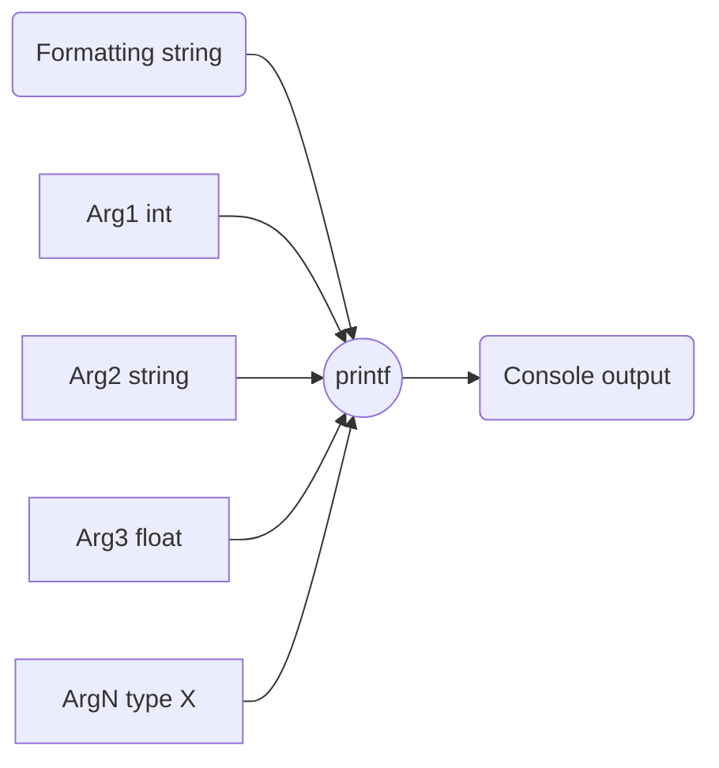

# printf() 🎉
-  `#1589F0` ## Description
The C library function **int printf(const char *format, ...)** sends formatted output to stdout.

 printf function is used to print integers along with string using %d in the arguments and send formatted output to stdout and pass variable names in a sequence and print output on the screen.

## Declaration
The following is the declaration for printf() function.

    int printf(const  char  *format,  ...)

### Specifiers

Specifier                |Output                        |Examples |
|----------------|-------------------------------|-----------------------------|
| `c` | Character | y |
| `d` or `i` | Signed integer | 1024, -1024 |
| `s` | String of characters | Hello Alx |
| `b` | Binary Representation of unsigned integer | 01010110 |
| `u` | Unsigned integer | 1024 |
| `o` | Unsigned octal | 432 |
| `x` | Unsigned hexadecimal integer | 3ca |
| `X` | Unsigned hexadecimal integer (uppercase) | 3CA |
| `S` | String with hex-ascii value replacing special chars | \x0A\x0A |
| `p` | Pointer address | 0x403212 |
| `r` | Reversed string of characters | dlroW olleH |
| `R` | ROT13 Translation of string | Uryyb |

### Flags (In development...)

|Flag                |Description                        |
|----------------|-------------------------------|
| `-` |Left-justify the output within the field width that was given; Right justification is the default (see _width_ sub-specifier). |
| `+` |Preceeds the result with a plus or minus sign (`+` or `-`) even for positive numbers. By default, only negative numbers are preceded with a `-` sign. |
| `(space)` |If no sign is going to be written, a blank space is inserted before the value. |
| `#` |Used with `o`, `x` or `X` specifiers the value is preceeded with 0, 0x or 0X respectively for values different than zero. |
| `0` |Left-pads the number with zeroes (`0`) instead of spaces when padding is specified (see _width_ sub-specifier). |

### Width (In development...)

|Width                |Description                        |
|----------------|-------------------------------|
| `(number)` |Minimum number of characters to be printed. If the value to be printed is shorter than this number, the result is padded with blank spaces. The value is not truncated even if the result is larger.|
| `*` | The _width_ is not specified in the _format_ string, but as an additional integer value argument preceding the argument that has to be formatted.|

### Precision (In development...)

|.Precision               |Description                        |
|----------------|-------------------------------|
| `.(number)` |**For integer specifiers (`d`, `i`, `o`, `u`, `x`, `X`):** _precision_ specifies the minimum number of digits to be written. If the value to be written is shorter than this number, the result is padded with leading zeros. The value is not truncated even if the result is longer. A _precision_ of 0 means that no character is written for the value 0. **For `s`**: this is the maximum number of characters to be printed. By default all characters are printed until the ending null character is encountered. If the period is specified without an explicit value for _precision_, 0 is assumed. |

### Lenght modifiers (In development...)

|Modifier/Specifier  |`d` & `i`  |`u`, `o`, `x`, `X` |`c` |`s` |`p` |
|----------------|---------|------------|-------------|-----|-------|
| `none` | int |unsigned int | int| char pointer| void pointer |
| `h` |short int|unsigned short int |     |     |              |
| `l` |long int |unsigned long int  |     |     |              |

------------

#### Files contained in this repository

------------

|Name                |Information                                        |
|----------------|-------------------------------|
|`main.h`	| Header file with the data type struct, standard libraries and custom prototypes.
|`main.c`|Entry point.
|`_printf.c`|Main printf function file. Calls other functions.
|`functions.c`|Print CHAR, A STRING, PERCENT SIGN, INT, BINARY.
|`functions1.c`|Print UNSIGNED NUMBER, UNSIGNED NUMBER IN OCTAL, UNSIGNED NUMBER IN HEXADECIMAL, HEXX NUM IN LOWER OR UPPER, PRINT BINARY.
|`functions2.c`|Print POINTER, NON PRINTABLE, REVERSE, A STRING IN ROT13, BINARY.
|`get_flags.c`|Calculates active flags.
|`get_precision.c`|Calculates the precision for printing.
|`get_size.c`|Calculates the size to cast the argument.
|`get_width.c`|Calculates the width for printing.
|`handle_print.c`|Prints an argument based on its type.
|`utils.c`|Evaluates if a char is printable.
|`write_handlers.c`|Write char, number,  a number using a bufffer, an unsigned number, a memory address.
|`a.out`|Executable file.

------------

### Authors &copy;

- Elsaaeid ellithy
- abdelrahman
